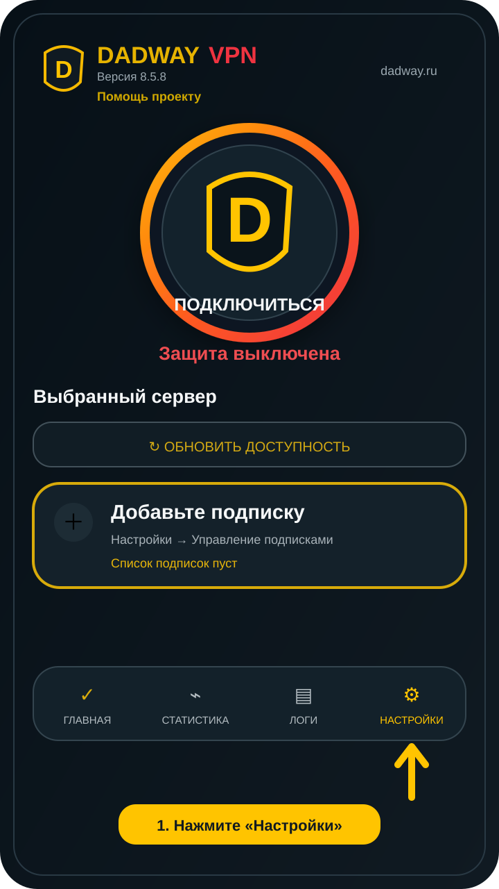
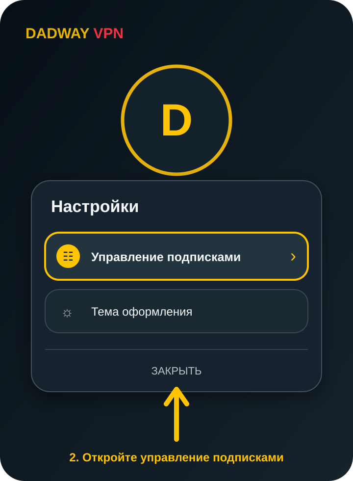
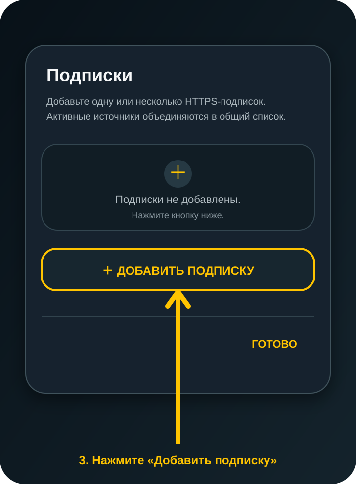
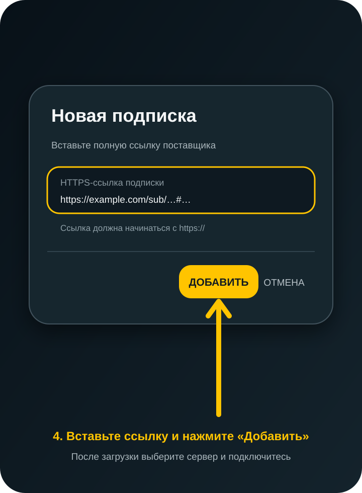

# Dadway VPN 8.5.5 — инструкция пользователя

В production-версии нет предустановленных подписок. При первом запуске нужно добавить собственную HTTPS-ссылку подписки. Все серверы загружаются только из включённых пользователем источников.

> Иллюстрации ниже повторяют элементы интерфейса версии 8.5.5. Расположение может немного отличаться в зависимости от размера экрана и выбранной темы.

## 1. Установка и обновление

1. Скачайте APK для архитектуры устройства:
   - `arm64-v8a` — большинство современных смартфонов, планшетов, складных устройств, Android TV и ChromeOS;
   - `armeabi-v7a` — старые 32-битные устройства.
2. Откройте APK и подтвердите установку из выбранного источника.
3. Для обновления установите новый APK поверх предыдущей production-сборки. Удалять приложение не нужно: идентификатор пакета и release-подпись сохранены.

Android не разрешит обновление поверх APK, подписанного другим ключом. Если ранее была установлена debug-сборка с иной подписью, система покажет конфликт пакета — это ограничение безопасности Android.

## 2. Первый запуск

После первого запуска на карточке сервера появится подсказка «Добавьте подписку». Нажмите кнопку **Настройки** в нижнем меню.

## 3. Открытие управления подписками

В окне **Настройки** выберите **Управление подписками**.

Здесь можно:

- добавить несколько подписок;
- включать и выключать каждый источник переключателем;
- удалить ненужный источник кнопкой корзины;
- объединить серверы из всех активных подписок в один список.

## 4. Добавление подписки

1. Нажмите **Добавить подписку**.
2. Вставьте полную HTTPS-ссылку, полученную у поставщика. Часть после символа `#` также оставьте в поле.
3. Нажмите **Добавить**.
4. Убедитесь, что переключатель новой подписки включён.
5. Нажмите **Готово** — приложение загрузит и проверит серверы.

Приложение принимает только защищённые ссылки, начинающиеся с `https://`. Если ссылка уже добавлена или имеет неверный формат, сообщение об ошибке появится под полем.

## 5. Выбор сервера и подключение

1. Нажмите карточку **Выбранный сервер**.
2. Выберите доступный сервер. В списке отображаются флаг страны, название, источник, статус и задержка.
3. Нажмите большую круглую кнопку **Подключиться**.
4. При первом подключении подтвердите системный запрос Android на создание VPN-соединения.
5. Разрешите уведомления, если Android запросит это разрешение. Постоянное уведомление показывает, что Dadway VPN подключён, и позволяет остановить VPN из шторки.

Зелёный статус **Готово** означает, что туннель запущен. После первого подключения приложение автоматически проверит внешний IP, задержку и скорость.

## 6. Включение и отключение подписок

Откройте **Настройки → Управление подписками**. Переключатель справа управляет источником:

- включён — серверы подписки участвуют в общем списке;
- выключен — источник сохраняется, но не загружается;
- корзина — подписка и её локальный кэш удаляются.

После изменения статуса приложение обновляет общий список. Для ручной загрузки используйте **Обновить список серверов** на главном экране.

## 7. Тема оформления

Откройте **Настройки → Тема оформления** и выберите:

- **Системная тема** — приложение следует настройке Android;
- **Светлая тема**;
- **Тёмная тема**.

Тема применяется ко всему приложению, включая диалоги, список серверов и управление подписками.

## 8. Статистика и журнал

- **Главная** — повторная проверка внешнего IP и соединения;
- **Статистика** — проверка IP, ping и скорости;
- **Логи** — сохранение диагностического файла. В имени файла автоматически указывается версия приложения;
- **Настройки** — подписки и оформление.

Журнал не содержит полной конфигурации подключения, UUID и ключей. При обращении в поддержку приложите сохранённый файл и опишите выбранный сервер и время ошибки.

## 9. Типовые сообщения

- **Список подписок пуст** — добавьте и включите хотя бы одну подписку.
- **Подписка недоступна** — проверьте интернет, срок действия и доступность HTTPS-ссылки.
- **Нет доступных серверов** — обновите список или выберите другой активный источник.
- **Ошибка подключения** — сохраните журнал, попробуйте другой сервер и передайте лог в поддержку.

Поддержка: [Telegram @gds_technical](https://t.me/gds_technical) 
Помощь проекту: [pay.cloudtips.ru/p/19a29f12](https://pay.cloudtips.ru/p/19a29f12)
